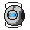

<h1>Return to Earth</h1>

<h3>About the Project</h3>

This is my small project about getting back to Earth after the events of Portal 2.
You play as the character "Wheatley" from said game.

The project was originally coded in Python with the PyGame library, 
but I decided to port it to C++ with SDL2 for fun.

<h3>Technical Details</h3>

I did all the development in VSCode on macOS Ventura and used brew to install the libraries needed.
I didn't include the dependencies in this repository. You'll have to find them elsewhere.

<h3>Current State</h3>

The game currently has movement, sprites, music, sounds, scrolling cubes and a scrolling star background.

<h3>Goals</h3>

I want to add a score counter, health system, an npc with dialogue, levels and perhaps an end sequence.
I'm certain this list will grow.

<h3>Demonstration</h3>

Click the image to view the demonstration on YouTube.

<h1>Bye Now</h1>

    
    

